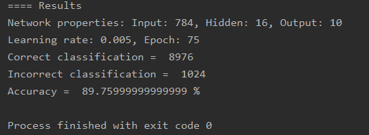

# ArtificialNeuralNetwork

The model was trained using various handwritten numbers (0-9). After 5000 image samples, the model was able to achieve 89.7% accuracy given 10000 images from the test set.

